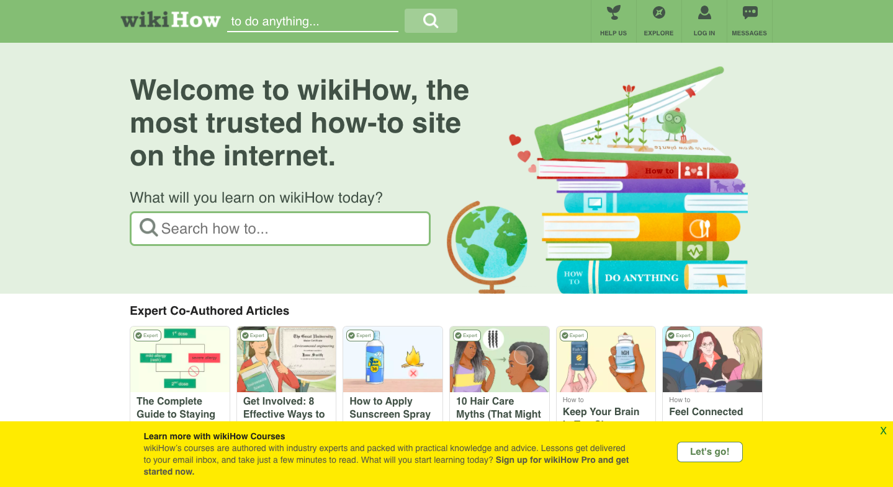
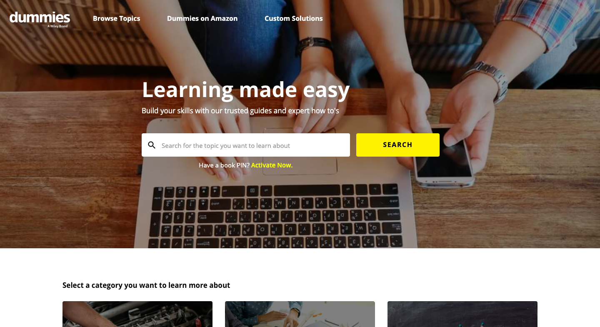
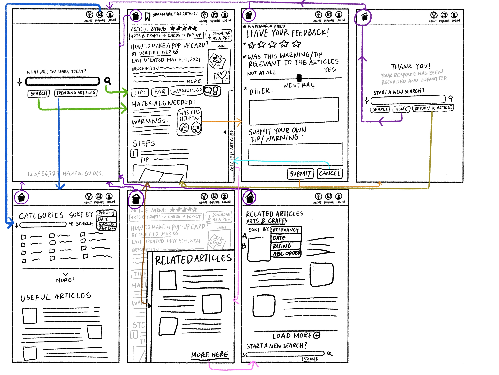

# Bridging Generations: The Intersection of Digital Instruction and Tentative Questions #
## Assignment 08: Project Portfolio & Documentation ##
__Digital Humanities 110 | Jacqueline "Jackie" Vo__

Project portfolio presentation and documentation.

## Introduction ## 

This quarter’s focus was to create a UX project that would be able to help the senior age group. In our pre-class survey, we were asked to view websites that would be useful to the older generation. I decided to survey and study instructional websites. Ever since COVID-19, digital instruction has been the center of most learning and instructional mediums. With this, people are most likely in separation from those who are normally able to help and support them on their learning endeavors (big or small). 

## Design Statement ## 

Most of the time, instructional websites are content heavy and are tailored to the younger generation. They dismiss the possibility that everyone’s intake in information is different and thus, the content that they have can be overwhelming to some users. A lot of the times, they assign a credible author to the instructional guide and leave the article up with no additional aid. This might discourage people from learning and reading guides on their own. 

The UX project that I am designing is meant to be a start towards bridging the generational gaps and lapses in knowledge; by working towards a more accessible design that is inspired by established websites, I am aiming to create inclusive spaces that will overlook age groups and their technological abilities. Learning should be a right and not a privilege.

## Competitor Analysis ## 

**wikiHow Evaluation** | **Dummies Evaluation**
--------------------|--------------------
[wikiHow](https://www.wikihow.com/Main-Page) | [Dummies](https://www.dummies.com/) |
 |  |

**Summary of Evaluations**: While wikiHow's website is overall an accessible site with relevant functions, the main issue with this website is that there is a lot of clutter. The website is content heavy and might overwhelm users. There are some issues that are listed explicitly in my heuristic evaluation but it is still overall a user-friendly site. On the other hand, Dummies has a sleek design and their design presentation is probably more favorable. Even so, Dummies does lacks in areas that hurt their statement about being able to make information less intimidating. Their guides might be shorter than their books but the lack of visuals and extra assistance can hurt learners that require more direction. 

> [See Heuristic Evaluation](https://github.com/jackieqvo/DH110-JACKIEVO/blob/65f1ef5318d353339d5812f39d6c9309fe071ac8/Assignments/Assignment%2001/Assignment%2001.md). | [See Pilot Usability Testing](https://github.com/jackieqvo/DH110-JACKIEVO/blob/65f1ef5318d353339d5812f39d6c9309fe071ac8/Assignments/Assignment%2002/Assignment%2002.md).

## User Research ## 

### Target Users ###

> **Demographics:** Anyone interested in learning about new skills and projects. People who are more inclined to learn on their own.
> 
> **Preferences:** Users who have the desire to learn and are looking for convenient resources to do so.
> 
> **Expertise:** Users do not need any particular level of expertise for this project.

The context of use for this project is that users will be able to learn how to make a greeting card. To complete this activity, users will be able to follow a set of instructions and a list of materials.

While the usability tests show me how someone might react and navigate to tasks on a website, a contextual inquiry gave the user more freedom to react to the website. 
Summary and link to your assignment folder. During the inquiry, I gave broad tasks so that my user would show me how they would normally navigate a website. Whenever she needs instructional guides, my user had a preference for websites with:

- Aesthetic visual presentation.
- Conciseness in content.
- Access to guides and answers in an efficient manner.

> [See Contextual Inquiry](https://github.com/jackieqvo/DH110-JACKIEVO/blob/9e960ee945838afe3d8766048f7fde06716bef47/Assignments/Assignment%2003/Assignment%2003.md).

## UX Storytelling ##

By utilizing UX storytelling, I will be able to better understand the user's perspective and thus, continue to filter out potential biases and personal points that I may have held onto during the usability testing and the contextual inquiry interview. In addition to this, UX storytelling is able to build upon the data that is gathered from these interviews by pushes the focus onto the user. These methods are meant to be user-centered and a user's experience goes beyond their interaction with a website or program's design.

The two personas I focus on are August and Anne. While August is a academically oriented individual, Anne is someone that is only beginning to learn again. The two personas are on opposite ends of the academic spectrum. With these personas and scenarios in mind, I would be able to visualize how to best help various users. Putting the user's thoughts and goals into perspective will help highlight potential problems with the website and program. Through this, I can better empathize with their personalized stories. 

> [Read More About UX Storytelling](https://github.com/jackieqvo/DH110-JACKIEVO/blob/abbad5eee060878559d52c536cb7ed5957dd83ee/Assignments/Assignment%2004/Assignment%2004.md).

## Wireframe and Graphic Design Element Variation ##

### Low-fidelity Prototype ###

> This project is looking to solve user difficulties when searching online for how-to guides in their day-to-day tasks. The target community is anyone looking to self-teach and learn. These users are people who prefer to look for solutions to their projects in an efficient and clear manner. Based on user research from previous assignments, the following features are meant to solve the overcomplicated guides that may be found on the internet. 

* **Minimalist Design**: To help users not feel so overwhelmed at the search results.
* **Recommendation Feature**: Takes into account the category of the search to suggest related articles for more specific guides. This feature will probably me a pull-out tab so it does not distract from the main article. 
* **Informational Section**: Content such as "Tips and Warnings" and "Things You'll Need" are more essential and should be emphasized. If strategically placed, users will be able to feel more confident and/or better gauge their capabilities before pursuing the project. *See next feature*: Users will be able to rate and critique content like materials, warnings, and even tips.
* **Ratings**: Articles are rated based on their concise and clear instructions. Think of an "upvote" on Reddit. With this, users will also be able to rate parts of the article and submit their own comments for improvement.

> Target users value efficiency and clarity when going through their how-to guides. In this project, the prototyping will be for the user's mobile experience with the site. User personas were created based on the premise of each individual's willingness to learn on their own for adequate solutions. While one user persona was a college student looking to maximize his time during remote learning, the other user persona needed to learn on her own so that she wouldn't have to depend on her family. 

> The purpose of this low-fidelity prototype is to test how these features are able to flow and function in this earlier rendition of this how-to website. These prototypes will help see if the features will work for users in a setting that is not imagined. As the designer, I will again be able to watch how my users navigate and feel about my features. In addition to this, it would be a good opportunity for me to ask if there is something that they feel is lacking from the website/mobile application. 

### Tasks ###
> This low fidelity prototype supports the following tasks:
> 1. Searching an article
> 2. Rating an article
> 3. Exploring the categories for the articles
> 4. Filtering articles with users' preferences

> 1. Blue arrows are for the explore page function.
> 2. The green arrows are for the search page function.
> 3. Purple arrows are to help the users navigate home. 
> 4. The pink arrows help navigate to related articles. 
> 5. Olive helps the user return to the article.
> 6. Orange represents the feedback option.

### Final Revisions ###

For the final prototype, the tasks mentioned above were altered. Some functions are not usable on the prototype while the function of looking for related articles and exploring more articles are merged into one section. Additional features were added as well. *See High-fidelity Prototype portion of this documentation*. 

> [Read More about the Process of Making a Low-Fidelity Prototype](https://github.com/jackieqvo/DH110-JACKIEVO/blob/98721efc44b71dd85f13e1087bf250c5ee31875d/Assignments/Assignment%2005/Assignment%2005.md). | [See Interface Design Part 1 and 2](https://github.com/jackieqvo/DH110-JACKIEVO/blob/c7b1f44259cf3a1624bedbccb53709f09f5d6012/Assignments/Assignment%2006/Assignment%2006.md).

## High-fidelity Prototype ## 

This high-fidelity prototype supports the following tasks:

* Searching up an article (article is predetermined).
  * Users will be looking up how to make a generic pop-up card.
* Looking into related articles.
  * On top of the exploration page, there will be tab that will let users explore related articles. In this case, the user will be looking at a navigation page that will lead them to other arts and crafts guides.
* Submitting feedback and cancelling the submission.
  * Users will get the chance to submit feedback (fake interaction with established text). There will be required fields but users are also able to cancel their submission. There will be overlays that asks the user if they are sure they are ready to submit, cancel, etc.
* Question submission.
  * When looking through an article, users will be able to see frequently asked questions and also submit their own. This will be a fake interaction with established text. 
* Bookmarking (saving) and unbookmarking (unsaving) article(s).
* Checking trending categories to explore the website.
  * This trending categories page is a concept. The working button will be the arts and crafts category. Upon clicking this, they will be revisiting the related articles page.
* Dark mode.
  * Dark mode is sampled only on the homepage. I went with the color scheme of **#696969** for the background and **#E9E9E9** and **#FFFFFF** for the text, borders, and buttons. Aside from the color, the format should remain the same. 

<iframe style="border: 1px solid rgba(0, 0, 0, 0.1);" width="800" height="450" src="https://www.figma.com/embed?embed_host=share&url=https%3A%2F%2Fwww.figma.com%2Fproto%2FRTitlnkgJGe96PjHmSxgjf%2FGenius-Mobile-Prototype%3Fnode-id%3D8%253A33%26scaling%3Dscale-down" allowfullscreen></iframe>

> [Link to Prototype](https://www.figma.com/proto/RTitlnkgJGe96PjHmSxgjf/Genius-Mobile-Prototype?node-id=8%3A33&scaling=scale-down&page-id=0%3A1) in case the embed does not work. | [Link to wireflow and wireframe](https://www.figma.com/file/RTitlnkgJGe96PjHmSxgjf/Genius-Mobile-Prototype?node-id=0%3A1).

> [See Interface Design Part 1 and 2](https://github.com/jackieqvo/DH110-JACKIEVO/blob/c7b1f44259cf3a1624bedbccb53709f09f5d6012/Assignments/Assignment%2006/Assignment%2006.md).

### Summary Statement ###

This high-fidelity prototype was made using Figma. Being able to learn an entirely new program to create an entire prototype over the course of one quarter has been very rewarding. Figma helped me solidify my vision for an instructional website. From designing screens to testing various colors and logo options, I was also able to conduct usability tests so I could further improve my design.

## Optional Evaluation and Revision History ##

While most of the evaluation and revision history can be found [here](https://github.com/jackieqvo/DH110-JACKIEVO/blob/c7b1f44259cf3a1624bedbccb53709f09f5d6012/Assignments/Assignment%2006/Assignment%2006.md), the most recent usability test used to help finalize the prototype for this web documentation can be found [here](https://drive.google.com/file/d/1OmnNJX7QZp0JnFfdQNXlOhbW0ZT5xXZp/view?usp=sharing). The script for the usability test can be found [here](https://forms.gle/WR1MyeDG4uEUWoWY6).

## Pitch video ## 

The pitch presentation can be found [here](https://drive.google.com/file/d/1FXq8oiIYLijdmgmTeH1EwSW_R3Xfh7Lw/view?usp=sharing).

## Conclusion ## 

I am grateful for being able to learn as much as I did. In less than three months, I learned how to prototype something that can actually be tested. I got to get a glimpse of what being a UX designer might entail and it's safe to say that I am ending this course with even more interest in the field than I started with. Something I regret is not having more time and not knowing about UX design sooner. If I had more time, I would have loved to conduct more usability tests and find more people that fit my target users. I think it would have also been interesting to design my own buttons and logos from scratch. I was going to look into other programs with various features but I did not have enough time. 

In terms of this project, I had two personas that encapsulated my target users well. I believe that I tested enough people (both technologically inclined and not) to conclude that despite always having room for improvement, this prototype is headed in a good direction. In the future, I am hoping to learn more and maybe transfer this prototype to another program. UX designs are constantly being tested and redesigned. I like that I am reminded that there is always space to do better. I really enjoyed this class and I appreciated the prompt that was presented to us for this project even more. 

For the future, I hope to always be in a space where I am constantly learning. I hope that I can keep up the practice of documentation and working towards creating more user-centered products. My greatest takeaway from this class that UX design is not something that is purely based on aesthetics. There is an assumption that design and aesthetics are concrete and must go hand in hand but a visually aesthetic design does not guarantee that it is equitable or even user-friendly. It is only one component of a good UX design.

Overall, I hope that this project is a good step towards promoting online instruction by aiding scholars regardless of their age and skill.
